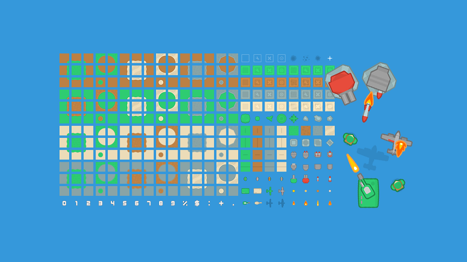

# Tower Defense

A 2D tower defense game built with [pygame-ce](https://github.com/pygame-community/pygame-ce). Defend the path through 25 waves of escalating enemies by buying, placing, and upgrading towers along a fixed Tiled-authored map.



## Gameplay

- **Lives:** 10. Each enemy that reaches the exit costs lives equal to its damage value.
- **Money:** Start with $200. Earn money by killing enemies; spend it on towers and upgrades.
- **Waves:** 25 hand-tuned waves. Enemy HP and payout scale +25% per wave; each wave's total payout funds roughly one upgrade.
- **Win condition:** Survive all 25 waves.

### Enemies

| # | Role         | HP  | Speed | Reward | Damage |
|---|--------------|-----|-------|--------|--------|
| 1 | Grunt        | 20  | 1.0   | 4      | 1      |
| 2 | Fast runner  | 55  | 1.6   | 10     | 1      |
| 3 | Bruiser      | 160 | 0.9   | 28     | 2      |
| 4 | Tank         | 420 | 0.7   | 75     | 3      |

### Towers

| # | Name           | Levels | Price (L1) | Behaviour                                |
|---|----------------|--------|------------|------------------------------------------|
| 1 | Rapid gun      | 1      | $80        | Cheap starter — fast, low damage         |
| 2 | Homing missile | 3      | $220       | Tracks targets; scales hard with upgrades |
| 3 | Heavy cannon   | 2      | $380       | Long-range artillery, slow heavy hits    |
| 4 | Plane          | 2      | $600       | Cosmetic flyover (no attack)             |

All stats live in `config/towers.yaml`, `config/enemies.yaml`, and `config/waves.yaml` — tweak freely.

## Running

```bash
git clone --recurse-submodules https://github.com/umutcanekinci/tower-defense.git
cd tower-defense
uv sync
uv run python __main__.py
```

Dependencies are managed with [uv](https://docs.astral.sh/uv/) (see `pyproject.toml` and `uv.lock`). `src/pygame_core` is a git submodule installed as an editable path dependency — if you forgot `--recurse-submodules`, run `git submodule update --init`.

## Project layout

```
__main__.py            Entry point
src/app/game.py        Game class — wires all subsystems
src/                   Tower, enemy, wave, HUD, panel, tilemap, camera code
src/pygame_core/       Engine submodule (Application, Animator, GuiObject, ...)
config/                YAML: assets, towers, enemies, waves, panels
assets/                Images, sounds, fonts, Tiled project
```

See [CLAUDE.md](CLAUDE.md) for an architecture overview (subsystems, rendering order, panel/UI system, coordinate system).

## Credits

Art and UI from [Kenney](https://www.kenney.nl/) — [Tower Defense (Top-Down)](https://www.kenney.nl/assets/tower-defense-top-down) and [UI Pack](https://www.kenney.nl/assets/ui-pack). Coin pickup art from [La Red Games — Gems & Coins](https://laredgames.itch.io/gems-coins-free).

## License

See [LICENSE](LICENSE).
