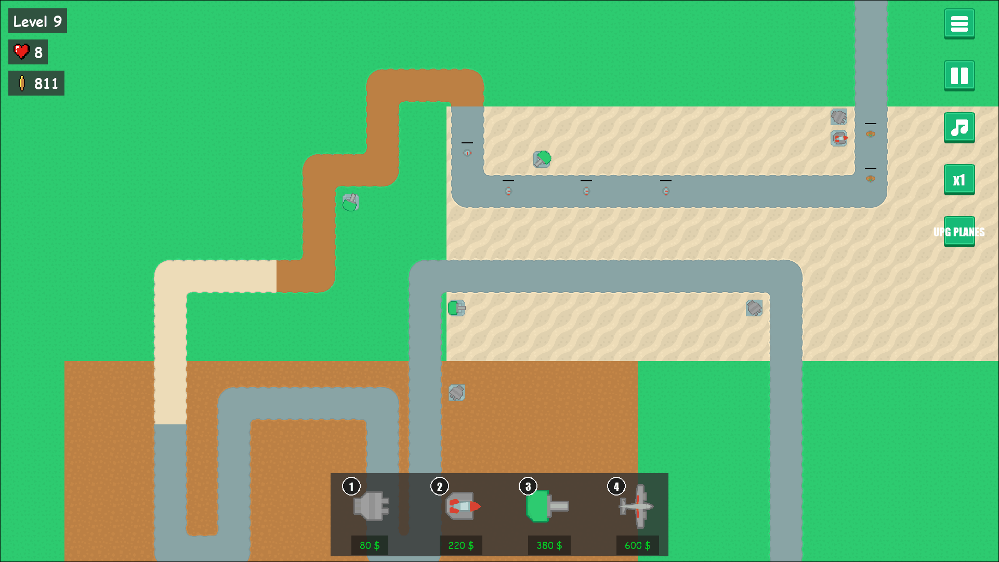
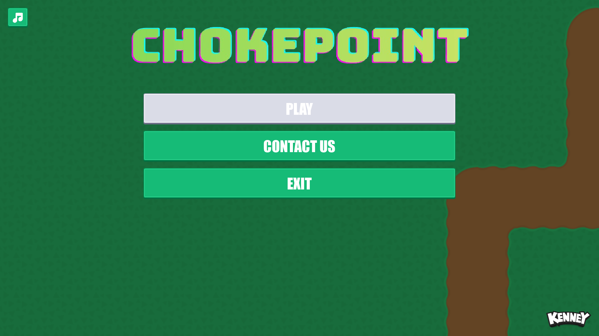

# Chokepoint


Chokepoint is a 2D tower defense game built with [pygame-ce](https://github.com/pygame-community/pygame-ce). Defend the path through 25 waves of escalating enemies — then keep going in endless mode — by buying, placing, and upgrading towers along a fixed Tiled-authored map.



## Gameplay

You start with **$200** and **10 lives**. Buy towers from the HUD on the right, place them on the map, and upgrade them as you earn money from kills. Survive all 25 waves to win — clearing wave 25 opens a victory screen where you can play again, return to the main menu, or keep going in endless mode as waves keep escalating past 25. Enemy HP and reward scale +25% per wave; each wave's total payout funds roughly one upgrade.

### Screenshots

| Menu | Gameplay | Upgrades |
|------|----------|----------|
|  |  |  |

### Enemies

| # | Role         | HP   | Speed | Reward | Damage |
|---|--------------|------|-------|--------|--------|
| 1 | Grunt        | 20   | 1.0   | 4      | 1      |
| 2 | Fast runner  | 55   | 1.6   | 10     | 1      |
| 3 | Bruiser      | 160  | 0.9   | 28     | 2      |
| 4 | Heavy        | 420  | 0.7   | 75     | 3      |
| 5 | Tank         | 800  | 0.5   | 200    | 5      |
| 6 | Siege tank   | 1500 | 0.4   | 400    | 8      |

Types 5–6 are armed: while advancing, they fire on the nearest ground tower in range, chipping away its HP until it's destroyed.

### Towers

| # | Name           | Levels | Price (L1) | Behaviour                                |
|---|----------------|--------|------------|------------------------------------------|
| 1 | Rapid gun      | 1      | $80        | Cheap starter — fast, low damage         |
| 2 | Homing missile | 3      | $220       | Tracks targets; scales hard with upgrades |
| 3 | Heavy cannon   | 2      | $380       | Long-range artillery, slow heavy hits    |
| 4 | Plane          | 2      | $600       | Flies over the map, dropping bombs along its path |

All stats live in `config/towers.yaml`, `config/enemies.yaml`, and `config/waves.yaml` — tweak freely.

### Controls

| Action | Input |
|---|---|
| Select / place tower | Left click |
| Open tower upgrade panel | Click a placed tower |
| Cancel placement | Right click |

## Download

[](https://umutcanekinci.itch.io/chokepoint)

Grab a ready-to-play build for your OS from [itch.io](https://umutcanekinci.itch.io/chokepoint) or the [latest GitHub release](https://github.com/umutcanekinci/chokepoint/releases/latest) — no Python required. Unzip and run:

| OS | Run |
|----|-----|
| Windows | Extract `chokepoint-windows.zip`, run `chokepoint.exe` |
| macOS | Extract `chokepoint-macos.zip`, open `Chokepoint.app` |
| Linux | Extract `chokepoint-linux.zip`, run `./chokepoint/chokepoint` |

> macOS Gatekeeper: the app is unsigned, so the first launch needs **right-click → Open** (or `xattr -dr com.apple.quarantine Chokepoint.app`).
>
> Windows SmartScreen: the app is unsigned, so the first launch shows **"Windows protected your PC."** Click **More info → Run anyway**. This is Microsoft's download-reputation check, not a virus warning — brand-new unsigned executables always trigger it.

## Requirements (from source)

- Python 3.12+
- [pygame-ce](https://github.com/pygame-community/pygame-ce), colorama, pyyaml, pytmx (resolved automatically from `pyproject.toml` / `uv.lock`)
- [uv](https://docs.astral.sh/uv/) (optional but recommended)

## Running

```bash
git clone --recurse-submodules https://github.com/umutcanekinci/chokepoint.git
cd chokepoint
uv sync
uv run python __main__.py
```

If you forgot `--recurse-submodules`: `git submodule update --init`.

Without `uv`: `pip install .` then `python __main__.py`.

## Building a standalone bundle

Builds are produced by [PyInstaller](https://pyinstaller.org/) from `chokepoint.spec`, which bundles `assets/` and `config/` alongside the executable (onedir). To build locally for your current OS:

```bash
uv sync --group build
uv run python scripts/make_icon.py   # optional, Windows icon from the logo
uv run pyinstaller chokepoint.spec --noconfirm
```

The result lands in `dist/chokepoint/` (`dist/Chokepoint.app` on macOS).

### Cutting a release

Per-OS bundles for Windows, macOS, and Linux are built and published automatically by [`.github/workflows/release.yml`](.github/workflows/release.yml) when a version tag is pushed:

```bash
git tag v0.1.0
git push origin v0.1.0
```

The workflow builds on each OS, zips the bundle, attaches all three to a GitHub Release (with auto-generated notes), and pushes each build to its [itch.io](https://umutcanekinci.itch.io/chokepoint) channel via [Butler](https://itch.io/docs/butler/). Use the workflow's **Run workflow** button to test a build without publishing.

## Project layout

```
__main__.py            Entry point — injects src/ + src/pygamine/ into sys.path
src/app/game.py        Game class — wires all subsystems
src/domain/            Pure data (GameState, protocols)
src/gameplay/          Combat, tilemap, enemies, projectiles
src/towers/            Tower hierarchy and factory
src/ui/                HUD, HP bars, menu background
src/util/              Config loaders, constants
src/pygamine/       Engine submodule (Application, Animator, PanelLoaderExt, ...)
config/                YAML: assets, panels, towers, enemies, waves
assets/                Images, sounds, fonts, Tiled project
```

See [CLAUDE.md](CLAUDE.md) for the full architecture overview.

## Credits

Art, UI, and sound from [Kenney](https://www.kenney.nl/) — [Tower Defense (Top-Down)](https://www.kenney.nl/assets/tower-defense-top-down), [UI Pack](https://www.kenney.nl/assets/ui-pack), [Impact Sounds](https://www.kenney.nl/assets/impact-sounds), and [Smoke Particles](https://www.kenney.nl/assets/smoke-particles). Coin pickup art from [La Red Games — Gems & Coins](https://laredgames.itch.io/gems-coins-free).

## Contributing

1. Fork this repository.
2. Clone your fork: `git clone --recurse-submodules https://github.com/<you>/chokepoint.git`
3. Create a branch: `git checkout -b feature/<your-feature>`
4. Commit + push: `git commit -am "<message>" && git push origin feature/<your-feature>`
5. Open a pull request.

## Author

Umutcan Ekinci — [umutcannekinci@gmail.com](mailto:umutcannekinci@gmail.com)

See also the [contributors](https://github.com/umutcanekinci/chokepoint/contributors).

## License

See [LICENSE](LICENSE).
