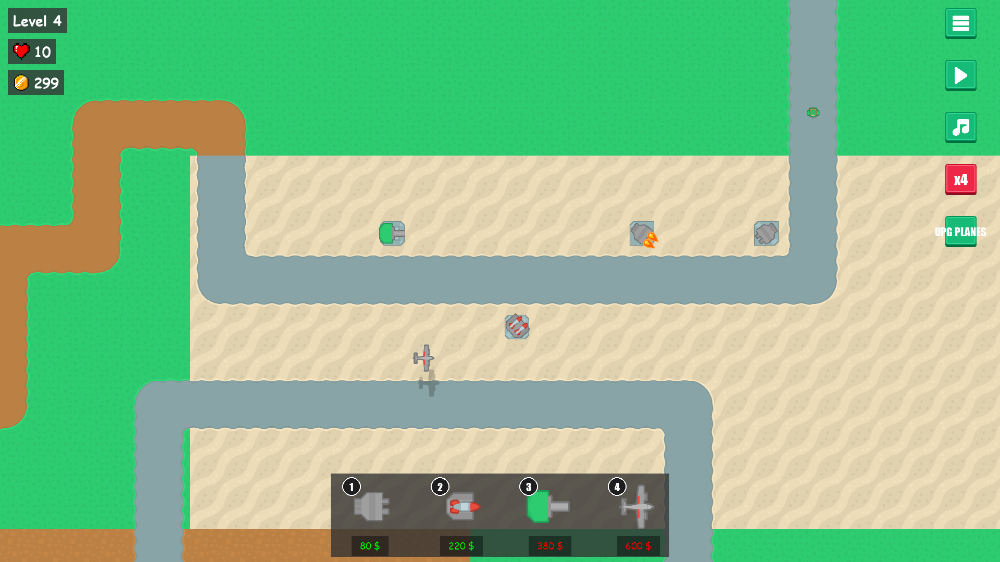
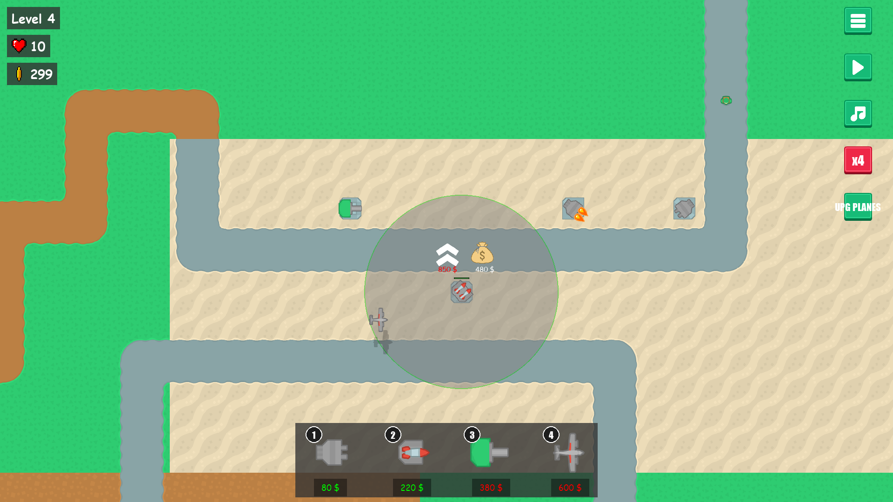

# Tower Defense

A 2D tower defense game built with [pygame-ce](https://github.com/pygame-community/pygame-ce). Defend the path through 25 waves of escalating enemies by buying, placing, and upgrading towers along a fixed Tiled-authored map.


## Gameplay

You start with **$200** and **10 lives**. Buy towers from the HUD on the right, place them on the map, and upgrade them as you earn money from kills. Survive all 25 waves to win. Enemy HP and reward scale +25% per wave; each wave's total payout funds roughly one upgrade.

### Screenshots

| Menu | Gameplay | Upgrades |
|------|----------|----------|
|  |  |  |

### Enemies

| # | Role         | HP  | Speed | Reward | Damage |
|---|--------------|-----|-------|--------|--------|
| 1 | Grunt        | 20  | 1.0   | 4      | 1      |
| 2 | Fast runner  | 55  | 1.6   | 10     | 1      |
| 3 | Bruiser      | 160 | 0.9   | 28     | 2      |
| 4 | Tank         | 420 | 0.7   | 75     | 3      |

### Towers

| # | Name           | Levels | Price (L1) | Behaviour                                |
|---|----------------|--------|------------|------------------------------------------|
| 1 | Rapid gun      | 1      | $80        | Cheap starter — fast, low damage         |
| 2 | Homing missile | 3      | $220       | Tracks targets; scales hard with upgrades |
| 3 | Heavy cannon   | 2      | $380       | Long-range artillery, slow heavy hits    |
| 4 | Plane          | 2      | $600       | Cosmetic flyover (no attack)             |

All stats live in `config/towers.yaml`, `config/enemies.yaml`, and `config/waves.yaml` — tweak freely.

### Controls

| Action | Input |
|---|---|
| Select / place tower | Left click |
| Open tower upgrade panel | Click a placed tower |
| Cancel placement | Right click |

## Requirements

- Python 3.12+
- [pygame-ce](https://github.com/pygame-community/pygame-ce), pyyaml, pytmx (resolved automatically from `pyproject.toml` / `uv.lock`)
- [uv](https://docs.astral.sh/uv/) (optional but recommended)

## Running

```bash
git clone --recurse-submodules https://github.com/umutcanekinci/tower-defense.git
cd tower-defense
uv sync
uv run python __main__.py
```

If you forgot `--recurse-submodules`: `git submodule update --init`.

Without `uv`: `pip install .` then `python __main__.py`.

## Project layout

```
__main__.py            Entry point — injects src/ + src/pygame_core/ into sys.path
src/app/game.py        Game class — wires all subsystems
src/domain/            Pure data (GameState, protocols)
src/gameplay/          Combat, tilemap, enemies, projectiles
src/towers/            Tower hierarchy and factory
src/ui/                HUD, HP bars, menu background
src/util/              Config loaders, constants
src/pygame_core/       Engine submodule (Application, Animator, PanelLoaderExt, ...)
config/                YAML: assets, panels, towers, enemies, waves
assets/                Images, sounds, fonts, Tiled project
```

See [CLAUDE.md](CLAUDE.md) for the full architecture overview.

## Credits

Art and UI from [Kenney](https://www.kenney.nl/) — [Tower Defense (Top-Down)](https://www.kenney.nl/assets/tower-defense-top-down) and [UI Pack](https://www.kenney.nl/assets/ui-pack). Coin pickup art from [La Red Games — Gems & Coins](https://laredgames.itch.io/gems-coins-free).

## Contributing

1. Fork this repository.
2. Clone your fork: `git clone --recurse-submodules https://github.com/<you>/tower-defense.git`
3. Create a branch: `git checkout -b feature/<your-feature>`
4. Commit + push: `git commit -am "<message>" && git push origin feature/<your-feature>`
5. Open a pull request.

## Author

Umutcan Ekinci — [umutcannekinci@gmail.com](mailto:umutcannekinci@gmail.com)

See also the [contributors](https://github.com/umutcanekinci/tower-defense/contributors).

## License

See [LICENSE](LICENSE).
